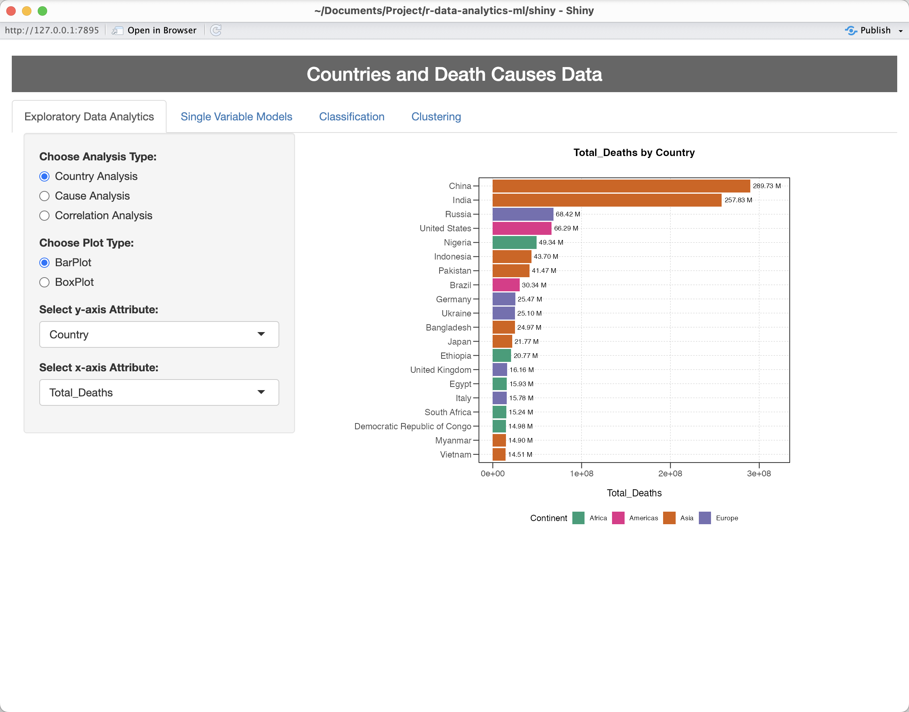
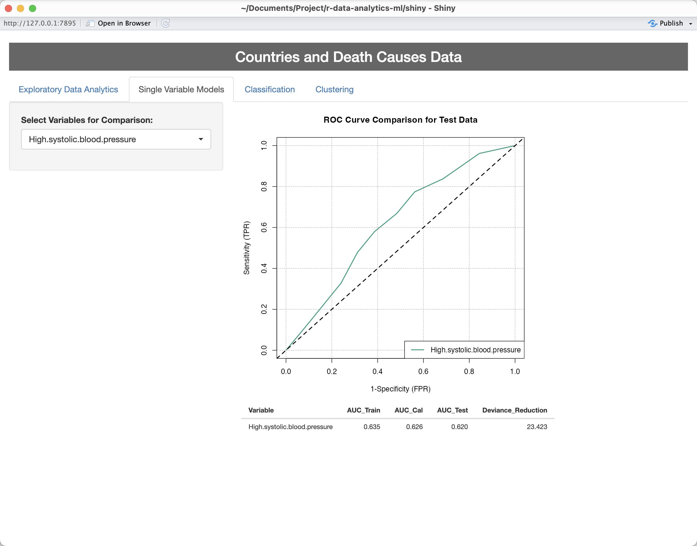
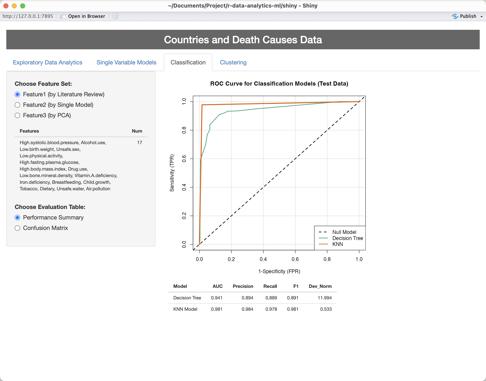
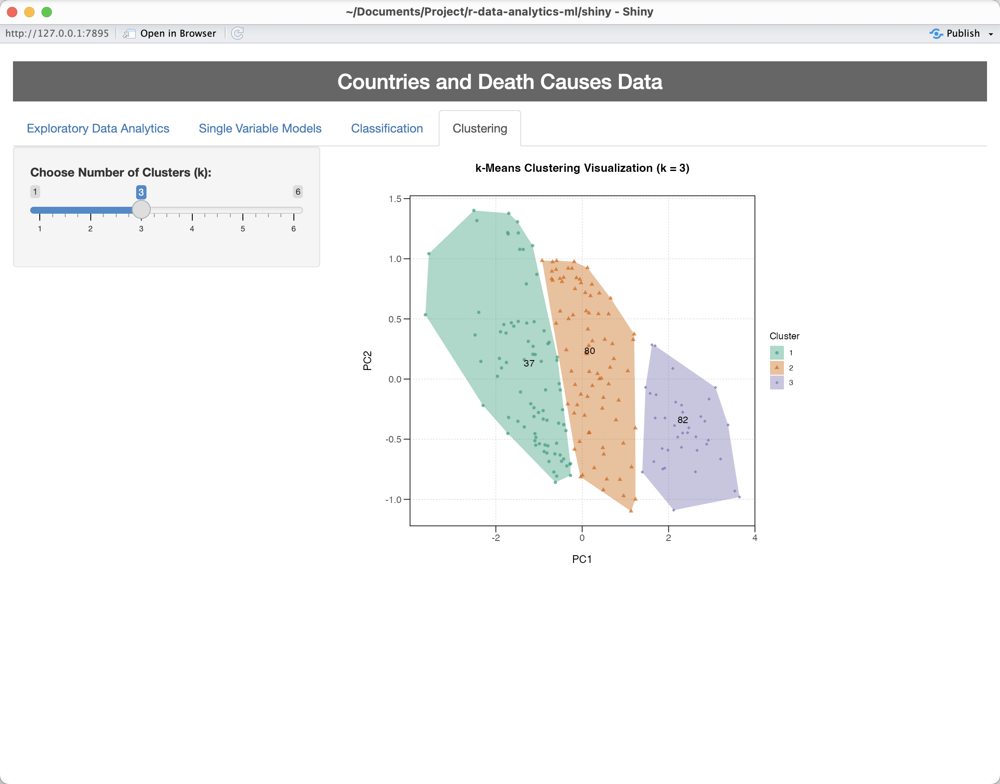

# **Countries and Death Causes (R)**

**YouTube Demo**: https://youtu.be/Ba1ZMSYzM7Y

This project analyzes global mortality patterns and health risk factors using data from the **World Health Organization (WHO)** and **World Bank**.

It combines statistical analysis, machine learning, clustering, and an interactive **Shiny application**.

## What This Project Does
- Exploratory data analysis of death causes across countries and years
- Classification models (Decision Tree, KNN) to predict high vs. low death-rate categories
- Feature selection using single-variable screening and PCA
- Model interpretability using LIME
- Unsupervised clustering (Hierarchical & k-Means) to identify country health-risk profiles
- Interactive Shiny app for visualization and model comparison

## Dataset
- **WHO**: Cause-specific mortality data (1990–2019)
- **World Bank**: Population and GDP per capita data
- **IHME / Our World in Data**: Risk factor classifications
Processed datasets are stored under data/processed and data/model_inputs.

## Report
A full analysis report is available as an HTML file:
```
report/analysis.html
```

The report is generated from an R Markdown notebook and includes EDA, modeling, clustering, and interpretation.

## How to Run
### Shiny App
```r
setwd("shiny")
shiny::runApp()
```

### Analysis Report
- Open report/analysis.html directly
- Or re-render from the R Markdown file

## Shiny App Preview

### Exploratory Data Analytics


### Single Variable Models


### Classification


### Clustering
